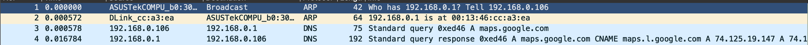
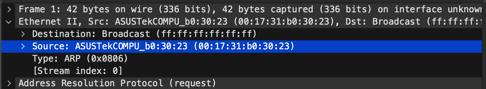
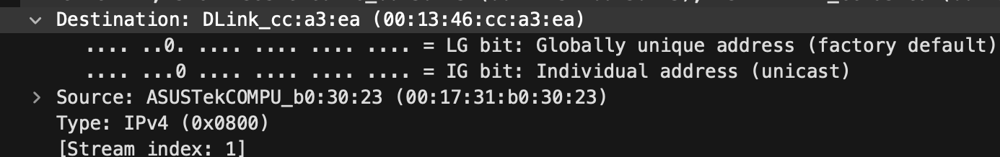

# Chapter 1 Practice and Review

Navigate to https://www.chappell-university.com/studyguide to download the supplemental files. 

The trace file used for this lab is titled `gen-googlemaps.pcapng` and is in the same directory as these note. 

## Trace File Questions and Answers

1. What is the hardware address of the client that is browsing to maps.google.com?

`00:17:31:b0:30:23`

The first two ARP packets obtain the hardware address of the DNS server. 

`Client IP: 192.168.0.106`

`DNS server IP: 192.168.0.1`

2. What is the IP address of the DNS server (which is also the router)?

`DNS server IP: 74.125.19.147`

Packets 3 and 4 are the DNS query/response packets. 

The DNS server provides 7 records - one record indicates that maps.google.com's real name (CNAME) is `maps.l.google.com`

The first address listed is `74.125.19.147`

3. What is the hardware address of the DNS server/router?

`DNS server/router hardware address: 00:13:46:cc:a3:ea`

4. What IP addresses are associated with maps.google.com?

`IP addresses: 74.125.19.147 A 74.125.19.104 A 74.125.19.105 A 74.125.19.99 A 74.125.19.106 A 74.125.19.103`

## Review Questions

### Q1.1 What is the purpose of network analysis?

Network analysis offers an insight into network communications to identify performance problems, locate security breaches, analyze application behavior, and perform capacity planning.

### Q1.2 Name at least three troubleshooting tasks that can be performed using network analysis

1. Locate faulty network devices
2. Measure high delays along a path
3. Locate the point of packet loss

### Q1.3 Why is network analysis considered a security risk by some companies?

Some companies consider network analysis to be a security risk because it involves tapping into network traffic and eavesdropping on communications. These companies fear that unencrypted information (data, email, etc.) may be seen by the network analyst. In reality, however, the network analyst can identify unsecure network communications to prevent unauthorized eavesdroppers from gaining insight into confidential communications.

